# 📚 Mermaid Diagram Templates Library

Ready-to-use templates for common agent scenarios.

## 🔄 Process Workflows

### Code Review Workflow

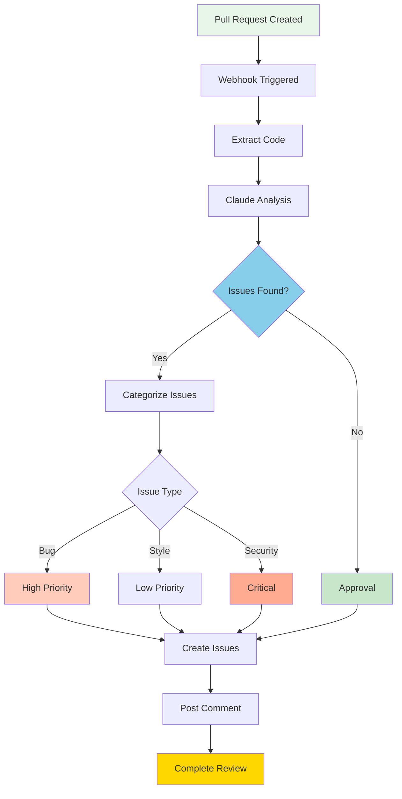

### Task Planning Workflow

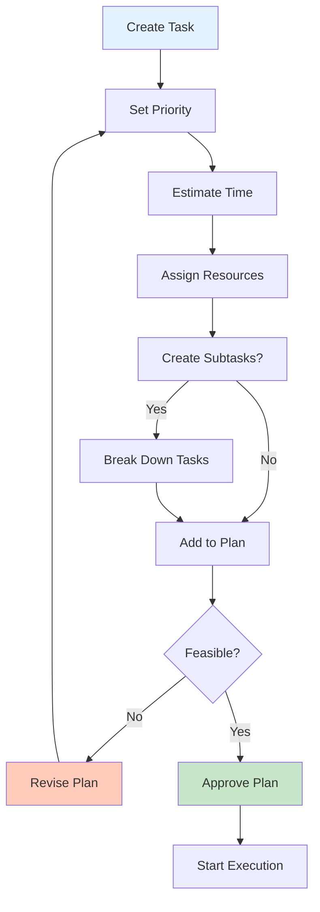

### Forecast Generation

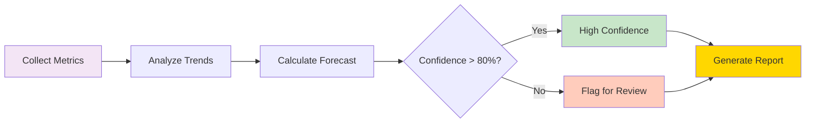

## 📊 Data Visualizations

### Task Priority Matrix

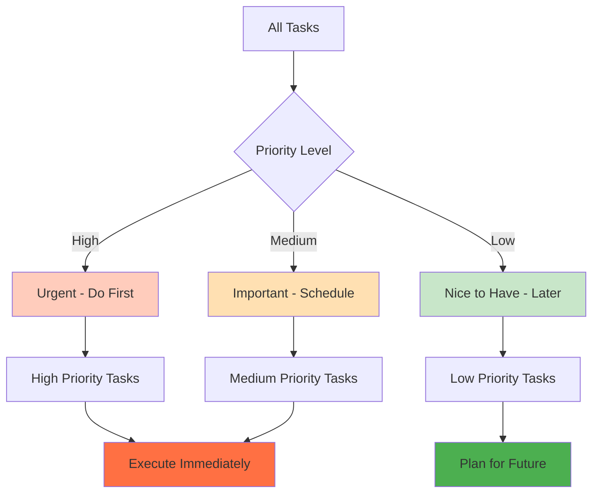

### Quality Metrics Dashboard

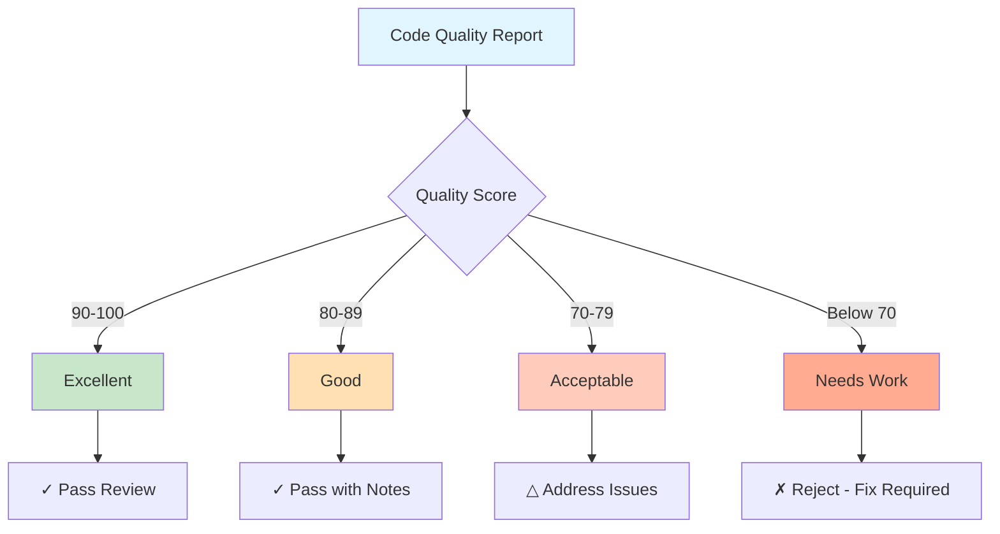

## 📅 Timeline & Scheduling

### Project Gantt Chart Template

```mermaid
gantt
    title Project Development Timeline
    dateFormat YYYY-MM-DD
    
    section Planning
    Requirements :req1, 2024-01-01, 5d
    Design :des1, after req1, 7d
    
    section Development
    Backend :dev1, after des1, 15d
    Frontend :dev2, after des1, 15d
    Integration :int1, after dev1, after dev2, 5d
    
    section Testing
    Unit Tests :test1, after int1, 5d
    Integration Tests :test2, after test1, 5d
    UAT :test3, after test2, 5d
    
    section Deployment
    Staging :deploy1, after test3, 2d
    Production :deploy2, after deploy1, 2d
    
    milestone Kickoff :mile1, 2024-01-01, 0d
    milestone Release :mile2, after deploy2, 0d
```

### Sprint Planning Gantt

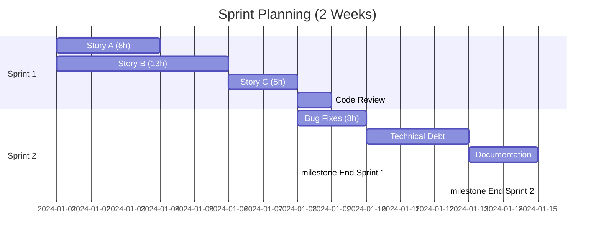

## 🔀 State & Sequence Diagrams

### Task Status State Machine

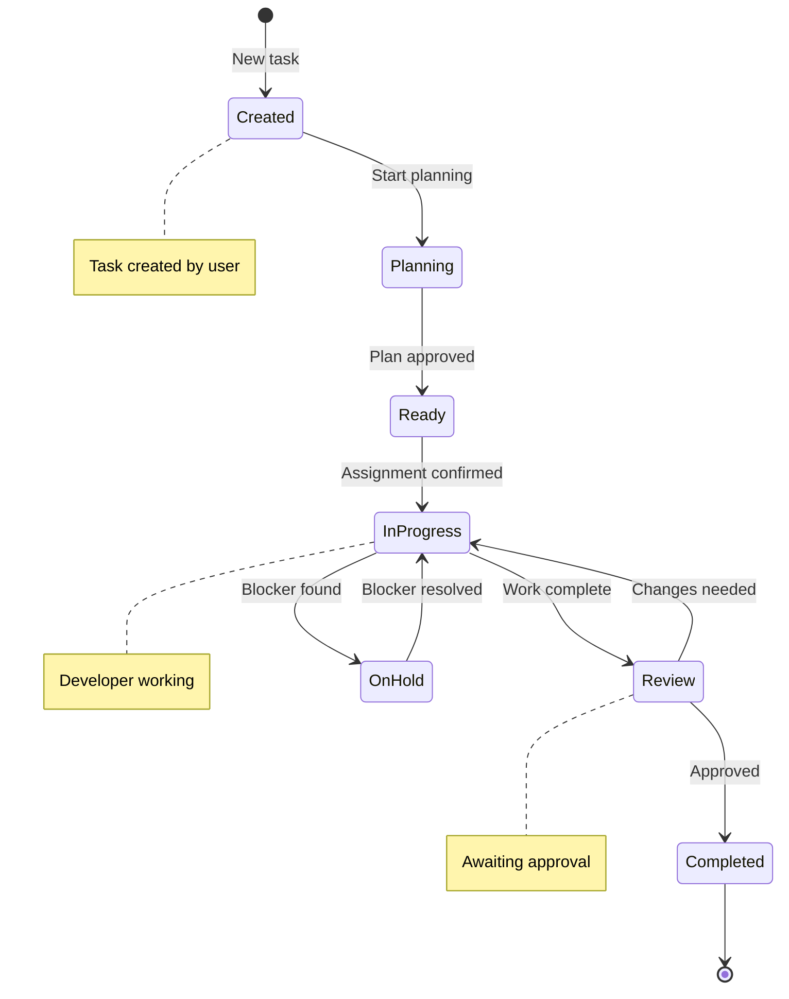

### Code Review Sequence

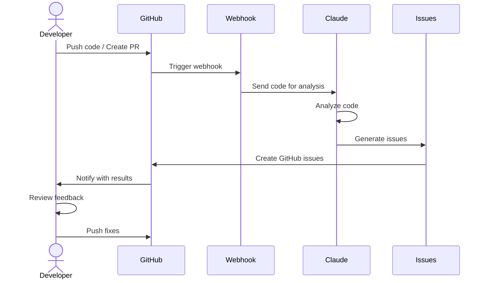

### Forecast Notification Sequence

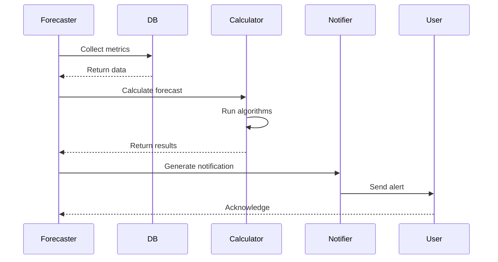

## 🏗️ Architecture Diagrams

### System Architecture

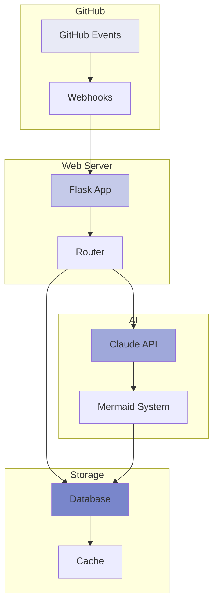

### Agent Architecture

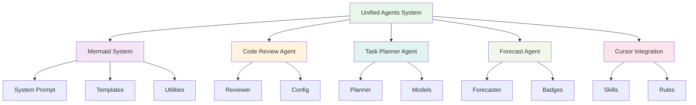

## 📈 Data Flow Diagrams

### Code Analysis Pipeline

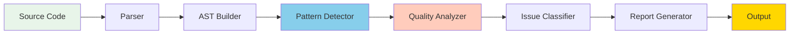

### Data Processing Pipeline

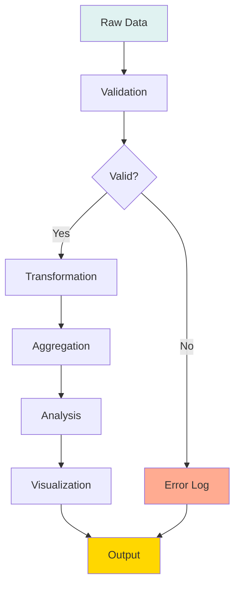

## 🎯 Decision Trees

### Prioritization Decision Tree

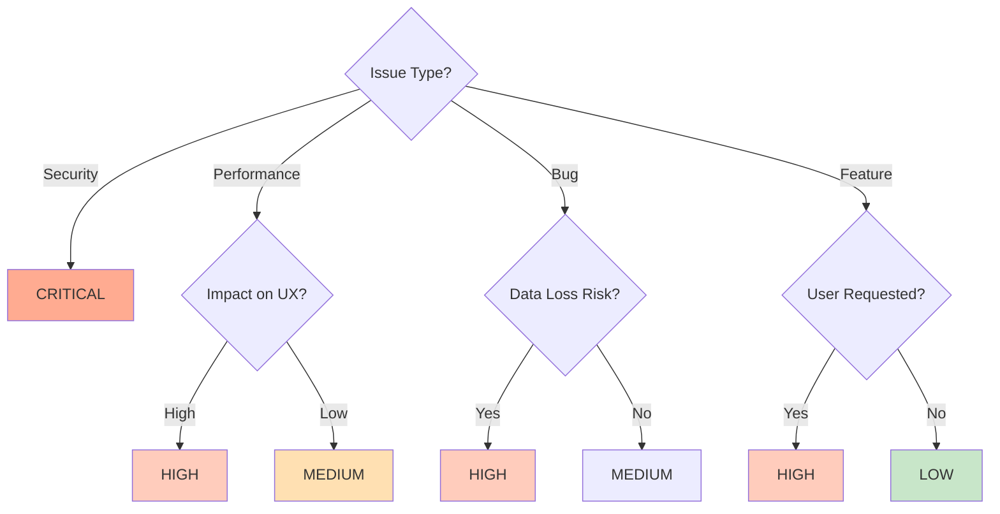

## 📊 Analytics Dashboards

### Task Distribution Chart

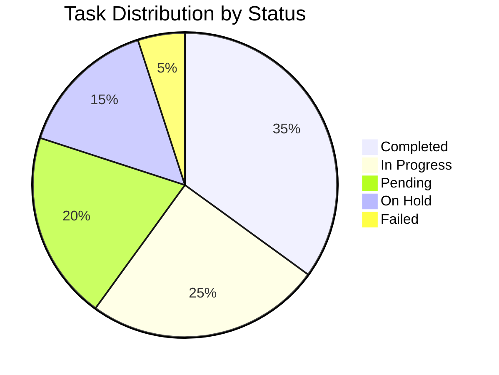

### Quality Metrics Distribution

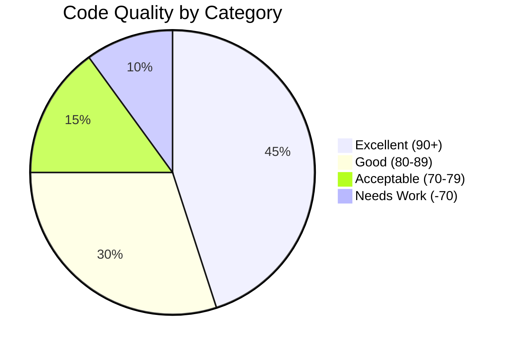

## 🚀 Class Diagrams

### Agent Class Structure

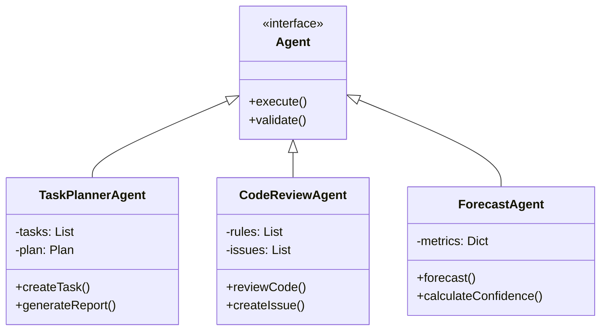

---

## 💡 How to Use Templates

1. Copy template you need
2. Modify labels/values for your data
3. Adjust colors as needed
4. Test in Mermaid Live Editor
5. Integrate into your agent

**Mermaid Live Editor**: [https://mermaid.live](https://mermaid.live)

---

**Version**: 1.0.0  
**Status**: Production Ready ✅  
**Last Updated**: 2024-12-17